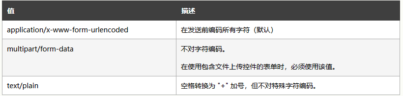

[TOC]

***


#### 表单

1. **基本用法和属性**


2.**高级用法(h5新增属性)**

1. autocomplete(on,off)      规定是否使用输入字段的自动完成功能。

2. autofocus(autofocus)      规定输入字段在页面加载时是否获得焦点。

3. disabled(disabled)            当 input 元素加载时禁用此元素。

4. readonly(readonly)           规定输入字段为只读。

5. required(required)            指示输入字段的值是必需的。

6. pattern(pattern)                 内容必须符合正则表达式所指的规则，否则就不能提交.

7. enctype:                                ( 见下图)

    


#### 表单实例

```html

<p>邮箱:<input type="email"（邮箱）  name="email"/></p>
<input type="submit"/>


<p>请输入数字:<input type="number"(数字)  name="num" min="0"(允许的最小值) max="100"(允许的最大值) step(合法的数字间隔)="10"/></p>


<p>请输入数字:<input type="range"(滑块)  name="range1" min="0"(允许的最小值) max="10"(允许的最大值) step(合法的数字间隔)="2"/></p>

<input type="text" name="tel"  required pattern（验证规则，正则表达式）="^1[358]\d{9}" />

```


***

#### 表格

1. **基本用法和属性**

    

    

2.**元素tr和td共有属性**

```html
align     valign     bgcolor     width     height     
```


[TOC]
