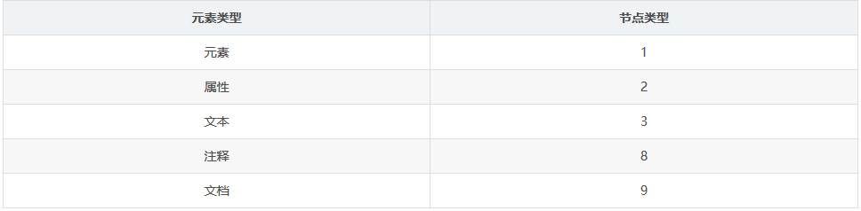

[TOC]

## BOM

*   所有 JavaScript 全局对象、函数以及变量均自动成为 window 对象的成员。
*   全局变量是 window 对象的属性。
*   全局函数是 window 对象的方法。


**实例**

```js
<script type="text/javascript">
    /*
    判断用户点击了OK还是Cancel，可以检查confirm()方法返回的布尔值：true表示单击了OK，false表示单击了Cancel或单击了右上角的X按钮。
     */
        if (confirm("Are you sure?")) {
            alert("I'm so glad you're sure! ");
        } else {
             alert("I'm sorry to hear you're not sure. ");
        }
    </script>
```

```js
<script type="text/javascript">
    /*
    prompt()方法用来生成一个"提示"框，用于提示用户输入一些文本。提示框除了显示OK和Cancel按钮之外 ，还会显示一个文本输入域，用来输入文本内容。该方法接收两个参数：要显示给用户的文本提示和文本输入域的默认值(可以是一个空字符串)
     */
        var result = prompt("What is your name? ", "");
        if (result !== null) {
         alert("Welcome, " + result);
        }
    </script>
```


## DOM

### DOM元素获取

```js
//获取元素
doucument.getElementById('id')  //id
doucument.getElementsByClassName('classname')  //classname(动态方法)
doucument.getElementByTagName('tagname')  //tagname(动态方法)
doucument.querySelector('css选择器') //通过选择器查找元素(返回第一个)
doucument.querySelectorAll('css选择器') //通过选择器查找元素(返回数组)
document.forms //获取当前页面所有form，返回一个 HTMLCollection 


//获取、设置自定义属性	
el.getAttribute('属性名');
el.setAttribute('属性名','属性值');
el.removeAttribute('属性名');
```

### DOM节点

1.  元素节点

    元素标签，比如<body><table><div>等等。

2.  文本节点

    任意的文字、空格、换行、空白行都算是文本节点。

3.  属性节点

    属性节点，故名思议就是其他节点的属性。例如所有的元素都有title属性，在title='title1'就是一个属性节点。

4.  注释节点


**childNodes和children**

childNodes：返回父元素所有的直系子节点的集合，注意，与children不同的是，childNodes会返回HTML元素节点，属性节点，文本节点。


**nodeType属性值**




### DOM元素属性


1.  **setAttribute** 

    ```js
    element.setAttribute(name, value);  
    ```

2.  **getAttribute**

    ```js
    var value = element.getAttribute("id"); 
    ```

3.  **hasAttribute**

    ```js
    var result = element.hasAttribute(name);
    
    var foo = document.getElementById("foo"); 
    if (foo.hasAttribute("bar")) { 
        // do something
    }
    ```

4.  **dataset**（获取html data-开头的属性）

    ```js
    <div id="user" data-id="1234567890" data-user="johndoe" data-date-of-birth>John Doe</div>
    
    let el = document.querySelector('#user');
    
    // el.id == 'user'
    // el.dataset.id === '1234567890'
    // el.dataset.user === 'johndoe'
    // el.dataset.dateOfBirth === ''
    
    el.dataset.dateOfBirth = '1960-10-03'; // set the DOB.
    
    // 'someDataAttr' in el.dataset === false
    el.dataset.someDataAttr = 'mydata';
    // 'someDataAttr' in el.dataset === true
    ```


### DOM样式

1.  **直接修改元素的样式**

    ```js
    elem.style.color = 'red';  
    elem.style.setProperty('font-size', '16px');  
    elem.style.removeProperty('color');  
    ```

2.  **动态添加样式规则**

    ```js
    var style = document.createElement('style');  
    style.innerHTML = 'body{color:red} #top:hover{background-color: red;color: white;}';  
    document.head.appendChild(style);  
    ```

3.  **classList获取样式class**

    ```js
    // div is an object reference to a <div> element with class="foo bar"
    div.classList.remove("foo");
    div.classList.add("anotherclass");
    
    // if visible is set remove it, otherwise add it
    div.classList.toggle("visible");
    
    // add/remove visible, depending on test conditional, i less than 10
    div.classList.toggle("visible", i < 10 );
    
    alert(div.classList.contains("foo"));
    
    // add or remove multiple classes
    div.classList.add("foo", "bar", "baz");
    div.classList.remove("foo", "bar", "baz");
    
    // add or remove multiple classes using spread syntax
    let cls = ["foo", "bar"];
    div.classList.add(...cls); 
    div.classList.remove(...cls);
    
    // replace class "foo" with class "bar"
    div.classList.replace("foo", "bar");
    ```

    

4.  **window.getComputedStyle**

    通过 element.sytle.xxx 只能获取到内联样式，借助 window.getComputedStyle 可以获取应用到元素上的所有样式，IE8或更低版本不支持此方法。

    ```js
    var style = window.getComputedStyle(element[, pseudoElt]);  
    ```

    

### DOM事件


### DOM操作

1.  #### 创建节点

    通过 createElement 创建的元素并不属于 document 对象，它只是创建出来，并未添加到html文档中，==要调用 appendChild 或 insertBefore 等方法将其添加到HTML文档中==。

    ```js
    document.createElement('元素')
    document.createTextNode('文本内容')
    document.createComment('注释')
    document.createDocumentFragment('文档碎片')
    ```

    

2.  #### 节点修改

    1.  **cloneNode**

        node.cloneNode(==true/false==) ，它接收一个bool参数，用来表示是否复制子元素。深度复制

        ```js
        var from = document.getElementById("test");  
        var clone = from.cloneNode(true);  
        clone.id = "test2";  
        document.body.appendChild(clone);  
        ```

        

    2.  **appendChild**(如果该节点存在，只会移动该节点到最后的位置)

        ```js
        parent.appendChild(child);
        ```

        

    3.  **insertBefore**

        ```js
        parentNode.insertBefore(newNode, refNode);  
        ```

        

    4.  **insertAdjacentHTML**（节点插入DOM树中的指定位置）

        ```js
        元素 .insertAdjacentHTML(position，text);
        ```

        **position**

        *   `'beforebegin'`：`element`本身之前。

        *   `'afterbegin'`：就在`element`第一个孩子之前。

        *   `'beforeend'`：在的`element`最后一个子之后的内。（appendChild）

        *   `'afterend'`：`element`本身之后。

            

    5.  **removeChild**

        ```js
        var deletedChild = parent.removeChild(node);  
        ```

        

    6.  **replaceChild**

        ```js
        parent.replaceChild(newChild, oldChild);  
        ```

    

    ### DOM节点关系树

    

1.  **frist/lastChild=>fristElementChild**
2.  **childNodes[n]/childNodes.item(n)=>children[n]**
3.  **childNodes.length=>childElementCount**

[TOC]

