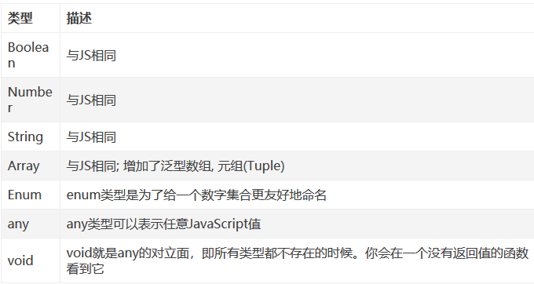

[TOC]

## typescript简介，安装，自动编译

### 简介

TypeScript 是 Microsoft 开发和维护的一种面向对象的编程语言。它是 ==JavaScript 的超集==，包含了 JavaScript 的所有元素，可以载入 JavaScript 代码运行，==并扩展了 JavaScript 的语法。==


### 优势

静态输入，大型开发项目，更好协作，更强生产力

### 安装

npm install -g typescript

### 配置和实时更新编译

根目录下：tsc--init 生成tscconfig.json文件

vscode下终端--->运行任务-->TSC监视


## 数据类型




```js
//ts定义布尔类型(boolean)
let a:boolean=false;
a=true;
console.log(a);

//ts定义number类型(number)
let b:number=11;

//ts定义字符串类型(string)
let str:string="张三"

//ts定义数组类型，这有两种方法(array)
let arr1:string[]=["张三","李四","王五"];
let arr2:Array<string>=["张三","李四","王五"];

//ts定义元组类型，元组类型也是数组类型的一种，如下(tuple)
let arr3:[number,string]=[2,'this is typescript'];

//ts定义枚举类型(enum) 枚举默认下标是0，也可以手动修改
enum Flag{success=1,error=0}
let f:Flag=Flag.success;
console.log(f);// 1

//当一个元素可能是null,可能是undefined，可能是number
let num:number| null|undefined;
num=123;
console.log(num);//123
num=null;
console.log(num);//null
num=undefined;
console.log(num);//undefined

//ts的void一般只用于定义函数的时候用
function run():void{
    alert("aaa");
}
run()
function run1():number{
    return 123
}
run1();
//ts中的never类型表示从不会出现的值包括undefined和null,一般很少用到
```

