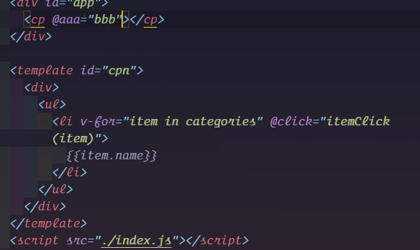
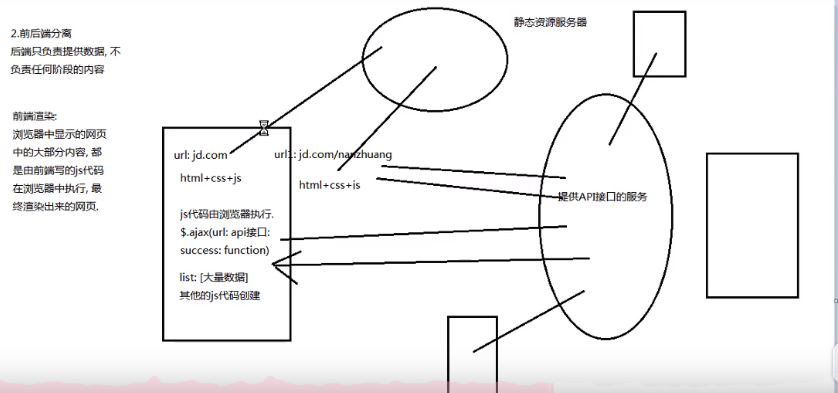

[TOC]

## 特点及搭建

### 特点

组件化，快速开发。

### 生命周期

钩子函数


### 项目搭建

1.  全局安装：npm install -g vue-cli
2.  初始化：vue init webpack 项目名称
3.  进入项目根目录并安装依赖模块：npm install
4.  启动项目：npm run dev


### vue的基本文件

1.  main.js:入口，导入各种文件

    

2.  ==App.vue根vue：最重要的是：<router-view/>路由视图，这里是全局配置==

    

3.  router里的index.js

    


## vue模板

### 应用模板

钩子函数：8个生命周期函数；

其他对象和data函数：data（）｛return{}｝,components,computed,methods等。


### 组件模板

#### 组件定义

传递参数：props

==自定义函数：this.$emit(函数名)==


#### 调用

1.  导入组件：import 
2.  注册组件：components:{}
3.  ==以标签名形式插入到templete中，并在标签中传递实参和绑定事件==


## vue基本语法和指令

### 模板语法｛｛｝｝

动态绑定变量：｛｛变量名｝｝

```vue
<span>Message: {{ msg }}</span>
```


### 指令

v-html,v-model,v-text,v-once,v-on,v-bind,v-pre,v-cloak

v-html="变量"  v-once(一次绑定)   v-on:事件名=“函数名（参数）”  简写@事件名= “函数名（参数）”     v-bind:属性=‘变量’  简写  ：属性=‘变量’

```vue
<span v-once>这个将不会改变: {{ msg }}</span>
<div v-html='msg'></div>
<div @click="say('hi')"">点击我</div>
<a ：href='newUrl'></a>                     
```


### 计算属性和监视器

对于任何复杂逻辑，你都应当使用**计算属性**。

当你有一些数据需要随着其它数据变动而变动时，watch：｛｝

```js
var vm = new Vue({
  el: '#demo',
  data: {
    firstName: 'Foo',
    lastName: 'Bar',
    fullName: 'Foo Bar'
  },
  watch: {
    firstName: function (val) {
      this.fullName = val + ' ' + this.lastName
    },
    lastName: function (val) {
      this.fullName = this.firstName + ' ' + val
    }
  }
})
```


## class和style绑定

1.  对象展开：

2.  传入对象

3.  传入数组

    


## 条件渲染（v-if等）


`v-if` 指令用于条件性地渲染一块内容。这块内容只会在指令的表达式返回 truthy 值的时候被渲染。

另一个用于根据条件展示元素的选项是 `v-show` 指令。用法大致一样。

注意，`v-show` 不支持 ` 元素，也不支持 `v-else`。

```js
<template v-if="ok">
  <h1>Title</h1>
  <p>Paragraph 1</p>
  <p>Paragraph 2</p>
</template>

//联合使用
<div v-if="type === 'A'">
  A
</div>
<div v-else-if="type === 'B'">
  B
</div>
<div v-else-if="type === 'C'">
  C
</div>
<div v-else>
  Not A/B/C
</div>
```


## 列表渲染（v-for）

参数可以多个：v-for='items in 数组/对象'   v-for='（items，index） in 数组/对象'  


## 事件修饰符和表单控件修饰符

1.  事件修饰符：stop,prevent,capture,self,once,passive

    ```js
    <!-- 阻止单击事件继续传播 -->
    <a v-on:click.stop="doThis"></a>
    
    <!-- 提交事件不再重载页面 -->
    <form v-on:submit.prevent="onSubmit"></form>
    
    <!-- 修饰符可以串联 -->
    <a v-on:click.stop.prevent="doThat"></a>
    
    <!-- 只有修饰符 -->
    <form v-on:submit.prevent></form>
    
    <!-- 添加事件监听器时使用事件捕获模式 -->
    <!-- 即内部元素触发的事件先在此处理，然后才交由内部元素进行处理 -->
    <div v-on:click.capture="doThis">...</div>
    
    <!-- 只当在 event.target 是当前元素自身时触发处理函数 -->
    <!-- 即事件不是从内部元素触发的 -->
    <div v-on:click.self="doThat">...</div>
    ```

    

2.  表单修饰符:lazy,number,trim

    ```js
    <!-- 在“change”时而非“input”时更新 -->
    <input v-model.lazy="msg">
        
    //如果想自动将用户的输入值转为数值类型
    <input v-model.number="age" type="number">
        
    //自动过滤用户输入的首尾空白字符
    <input v-model.trim="msg">
    ```

    

## 表单控件（v-model）

v-model指令在表单元素上双向数据绑定,获取的是value值。语法糖。

```js
 <input type="text" name="" id="" v-model="message"/>
    <input type="text" name="" id="" :value="message" @input="message=$event.target.value">
        
  <label :for="index" v-for="(item,index) in messages">
      <input
        type="checkbox"
        name=""
        :id="index"
        :value="item"
        v-model="hobbies"
      />{{item}}
    </label>
```


## DOM操作

在mounted()生命周期函数里执行。

==this.$refs.名字==


## 过渡和动画（transition）

### 普通过渡

过渡主要是两个阶段：==name替代class==

==v-enter-active,v-leave-active{}            v-enter,v-leave-to{}==


### css动画和导入动画文件


```js
<link href="https://cdn.jsdelivr.net/npm/animate.css@3.5.1" rel="stylesheet" type="text/css">

<div id="example-3">
  <button @click="show = !show">
    Toggle render
  </button>
  <transition
    name="custom-classes-transition"
    enter-active-class="animated tada"
    leave-active-class="animated bounceOutRight"
  >
    <p v-if="show">hello</p>
  </transition>
</div>
```

## 路由跳转

其实相当于a标签：<router-link to='路径名'></router-link>(不带参数)

<router-link :to='{name:"xxx",params:{xxx:xxx}}'>params</router-link>(带params参数)

<router-link :to='{name:"xxx",params:{xxx:xxx},qurey:{xxx:yyy}}'>qurey</router-link>(带qurey参数)

==不带参数则是to，带参数是动态绑定：to==


js绑定方法跳转：在标签上绑定@函数，在mounted（）里定义函数：

​    this.$router.push({ path: "/demo8" });

​    this.$router.push({name:'demo9',params:{userId:123,useName:'chen'}});

​    this.$router.push({name:'demo9',params:{userId:123,useName:'chen'},qurey:        {plan:'xxx'}});


## 组件

### 组件注册和使用

```js
!(function () {
  // 1创建组件构造器 2注册组件 3使用组件

  // const cp = Vue.extend({
  //   template: ` <div>
  //       <h2>我是标题</h2>
  //       <p>我是内容1</p>
  //       <p>我是内容2</p>
  //     </div>`,
  // })

  //语法糖（全局组件注册）
  Vue.component('my-cp', {
    template: ` <div>
        <h2>我是标题</h2>
        <p>我是内容1</p>
        <p>我是内容2</p>
      </div>`,
  })
  const app = new Vue({
    el: '#app',
    data: {},

      //template属性会替换掉el元素进行渲染
      template:`
			<div>
				<h2>我是template</h2>
			</div>
		`
    methods: {},

    //语法糖（局部组件注册）
    comments: {
      cp: {
        template: ` <div>
            <h2>我是标题</h2>
            <p>我是内容1</p>
            <p>我是内容2</p>
          </div>`,
      },
    },
  })
})()

```

### 组件的template抽离

```html
<!DOCTYPE html>
<html lang="en">
  <head>
    <meta charset="UTF-8" />
    <meta name="viewport" content="width=device-width, initial-scale=1.0" />
    <title>Document</title>
    <link rel="stylesheet" href="./index.css" />
    <link rel="stylesheet" href="../../reset.css" />
    <script src="../../vue.js"></script>
  </head>

  <body>
    <div id="app">
        <my-cp></my-cp>
    </div>

        <template id="cpn">
        <div>
          <h2>{{title}}</h2>
          <p>{{p1}}</p>
          <p>{{p2}}</p>
        </div>
      </template>
    <!-- <script type="text/x-template" id="cpn">
      <div>
        <h2>我是标题</h2>
        <p>我是p1</p>
        <p>我是p2</p>
      </div>
    </script> -->
    <script src="./index.js"></script>
  </body>
</html>

```


### 父子组件之间通信（props）


```js
!(function () {
  const app = new Vue({
    el: '#app',
    data: {
      movies: ['海王', '陈', 'sdasf'],
      message: '我是父组件信息',
    },

    components: {
      cp: {
        data() {
          return {}
        },
        template: '#cpn',
        props: {
          movie: {
              type:Array,
              //类型是对象或数组时，默认值必须是个函数
              default(){
                  return []
              }
          },
          message: String,
        },
      },
    },
  })
})()

```

### props

```js
props: {
    // fooA只接受数值类型的参数
    fooA: Number,
    // fooB可以接受字符串和数值类型的参数
    fooB: [String, Number],
    // fooC可以接受字符串类型的参数，并且这个参数必须传入
    fooC: {
        type: String,
        required: true
    },
    // fooD接受数值类型的参数，如果不传入的话默认就是100
    fooD: {
        type: Number,
        default: 100
    },
    // fooE接受对象类型的参数
    fooE: {
        type: Object,
        // 当为对象类型设置默认值时必须使用函数返回
        default: function(){
            return { message: 'Hello, world' }
        }
    },
    // fooF使用一个自定义的验证器
    fooF: {
        validator: function(value){
            return value>=0 && value<=100;
        }
    }
}
```

### 子父之间的通信（$emit）



```js
!(function () {
  const app = new Vue({
    el: '#app',
    data: {
      // movies: ['海王', '陈', 'sdasf'],
      // message: '我是父组件信息',
    },

    components: {
      cp: {
        template: '#cpn',
        data() {
          return {
            categories: [
              { id: 'aaa', name: '热门推荐' },
              { id: 'bbb', name: '手机数码' },
              { id: 'ccc', name: '家电家用' },
              { id: 'ddd', name: '电脑办公' },
            ],
          }
        },
        props: {
          movieInfo: Array,
          message: String,
        },
        methods: {
          itemClick(item) {
            // console.log(item)
            this.$emit('aaa', item)
          },
        },
      },
    },

    methods: {
      bbb(data) {
        console.log(data)
      },
    },
  })
})()

```

### 父子组件访问方式（$children,$refs）


### 子父组件访问方式（$root,$parent）


## slot插槽

### 使用（基础使用和具名插槽）


### 作用域插槽

==父组件替换插槽标签，但是内容有子组件来提供。==


## 前端模块化

### 雏形和简介

模块化主要是用来抽离公共代码，隔离作用域，避免变量冲突等。将一个复杂的系统分解为多个模块以方便编码。


### 模块化规范的方式（CommonJS，AMD，CMD，ES6模块化）

1.  CommonJS

    它有四个重要的环境变量为模块化的实现提供支持：`module`、`exports`、`require`、`global`。实际使用时，用`module.exports`定义当前模块对外输出的接口（不推荐直接用`exports`），用`require`加载模块。

    ```js
    // 定义模块math.js
    var basicNum = 0;
    function add(a, b) {
      return a + b;
    }
    module.exports = { //在这里写上需要向外暴露的函数、变量
      add: add,
      basicNum: basicNum
    }
    
    // 引用自定义的模块时，参数包含路径，可省略.js
    var math = require('./math');
    math.add(2, 5);
    
    // 引用核心模块时，不需要带路径
    var http = require('http');
    http.createService(...).listen(3000);
    
    ```

    

2.  AMD和require.js

    AMD规范采用异步方式加载模块，模块的加载不影响它后面语句的运行。所有依赖这个模块的语句，都定义在一个回调函数中，等到加载完成之后，这个回调函数才会运行。这里介绍用require.js实现AMD规范的模块化：用`require.config()`指定引用路径等，用`define()`定义模块，用`require()`加载模块。

    ```js
    /** 网页中引入require.js及main.js **/
    <script src="js/require.js" data-main="js/main"></script>
    
    /** main.js 入口文件/主模块 **/
    // 首先用config()指定各模块路径和引用名
    require.config({
      baseUrl: "js/lib",
      paths: {
        "jquery": "jquery.min",  //实际路径为js/lib/jquery.min.js
        "underscore": "underscore.min",
      }
    });
    // 执行基本操作
    require(["jquery","underscore"],function($,_){
      // some code here
    });
    
    //引用模块的时候，我们将模块名放在[]中作为reqiure()的第一参数；如果我们定义的模块本身也依赖其他模块,那就需要将它们放在[]中作为define()的第一参数。
    ```

3.  CMD

    CMD规范专门用于浏览器端，模块的加载是异步的，模块使用时才会加载执行。

    ```js
    //定义没有依赖的模块
    define(function(require, exports, module){
      exports.xxx = value
      module.exports = value
    })
    
    //定义有依赖的模块
    define(function(require, exports, module){
      //引入依赖模块(同步)
      var module2 = require('./module2')
      //引入依赖模块(异步)
        require.async('./module3', function (m3) {
        })
      //暴露模块
      exports.xxx = value
    })
    
    define(function (require) {
      var m1 = require('./module1')
      var m4 = require('./module4')
      m1.show()
      m4.show()
    })
    ```

4.  #### ES6模块化语法

    export命令用于规定模块的对外接口，import命令用于输入其他模块提供的功能。

    ```js
    /** 定义模块 math.js **/
    var basicNum = 0;
    var add = function (a, b) {
        return a + b;
    };
    export { basicNum, add };
    /** 引用模块 **/
    import { basicNum, add } from './math';
    function test(ele) {
        ele.textContent = add(99 + basicNum);
    }
    
    //就要用到export default命令，为模块指定默认输出。
    // export-default.js
    export default function () {
      console.log('foo');
    }
    // import-default.js
    import customName from './export-default';
    customName(); // 'foo'
    ```

### ES6 模块与 CommonJS 模块的差异

 **CommonJS 模块输出的是一个值的拷贝，ES6 模块输出的是值的引用**。

**CommonJS 模块是运行时加载，ES6 模块是编译时输出接口**。


第二个差异是因为 CommonJS 加载的是一个对象（即module.exports属性），该对象只有在脚本运行完才会生成。而 ES6 模块不是对象，它的对外接口只是一种静态定义，在代码静态解析阶段就会生成。


## 脚手架cli

### 简介和安装

Command-Line-Intface命令行界面，脚手架。拉取cli2模块：npm install 

```js
npm install -g @vue/cli-init
//# `vue init` 的运行效果将会跟 `vue-cli@2.x` 相同
vue init webpack my-project

//cli4
vue create 项目名称
npm run serve //启动项目

```


### runtimecompiler和runtimeonly区别

runtimecompiler:==template--(parse)-->ast(语法树)--(compile)-->render-->vdom-->DOM-->UI==

runtimeonly:render-->vdom-->DOM--UI


### render函数


## vue-router

### 什么是路由


### 后端渲染（后端路由 jsp）


### 前后端分离（后端提供数据，前端负责渲染数据）




### 前端路由（SPA）

单页富应用：自己有一个页面


### url的hash和HTML的history


### url的history


### router的index配置


### router-link属性和传递参数

1.  属性

    

2.  传参（：to属性）

    vue-router传递参数分为两大类

    编程式的导航 router.push   对象或字符串

    声明式的导航 <router-link>

    ==name配对的是params，和path配对的是query==

    

3.  $route和$router属性

    router为VueRouter的实例，相当于一个全局的路由器对象，里面含有很多属性和子对象，例如history对象。。。经常用的跳转链接就可以用this.$router.push，和router-link跳转一样。。

    

4.  

    


### 懒加载


### 路由的嵌套


### 导航守卫


1.  全局守卫。router.beforeEach 

    当从一个路由跳转到另一个路由的时候触发此守卫，这个守卫也叫全局**前置**守卫，所以它是跳转前触发的。任何路由跳转都会触发。

    ```js
    const router = new VueRouter({ ... })
     
    router.beforeEach((to, from, next) => {
      // ...
    })
    ```

    

2.  全局后置钩子 router.afterEach

    ```js
    router.afterEach((to, from) => {
      // ...
    })
    ```

    

3.  路由独享守卫。beforeEnter

    ```js
      {
        path: '/',
        name: "home",
        component: Home,
        // 路由独享守卫
        beforeEnter: (to, from, next) => {
          if(from.name === 'about'){
            alert("这是从about来的")
          }else{
            alert("这不是从about来的")
          }
          next();  // 必须调用来进行下一步操作。否则是不会跳转的
        }
      }
    
    ```

    

4.  路由组件内的守卫

    *   beforeRouteEnter()：进入路由前
    *   beforeRouteUpdate()：路由复用同一个组件时
    *   beforeRouteLeave()：离开当前路由时

    ```js
    <template>
      <div>
        <h1>{{ msg }}</h1>
        <p>我是:{{userName}}</p>
      </div>
    </template>
    <script>
      export default {
        name: 'user',
        data () {
          return {
            msg: '这里是 User Page.',
            userName: '叶落'
          };
        },
        methods: {},
        mounted () {
          var me = this;
          me.userName = me.$route.params.userName;
          console.log('user mounted.');
        },
        beforeRouteEnter (to, from, next) {
              // 在渲染该组件的对应路由被 confirm 前调用
              // 不！能！获取组件实例 `this`
              // 因为当守卫执行前，组件实例还没被创建
          console.log('component beforeRouteEnter');
          next();
        },
        beforeRouteUpdate (to, from, next) {
         // 在当前路由改变，但是该组件被复用时调用
        // 举例来说，对于一个带有动态参数的路径 /foo/:id，在 /foo/1 和 /foo/2 之		间跳转的时候，
        // 由于会渲染同样的 Foo 组件，因此组件实例会被复用。而这个钩子就会在这个情况		下被调用。
        // 可以访问组件实例 `this`
          console.log('component beforeRouteUpdate');
          next();
        },
        beforeRouteLeave(to,from,next){
             // 导航离开该组件的对应路由时调用
        	// 可以访问组件实例 `this`
    
          console.log('component beforeRouteLeave');
          next();
        }
      };
    </script>
    ```

    

5.  整个路由守卫被触发流程的步骤

    

    

### keep-alive

是Vue的内置组件，能在组件切换过程中将状态保留在内存中，防止重复渲染DOM。

包裹动态组件时，会**缓存不活动的组件实例**，而不是销毁它们。

只是一个抽象组件，它不会在DOM树中渲染(真实或者虚拟都不会)，也不在父组件链中存在

**keep-alive生命周期钩子函数：activated、deactivated**

```js
//预先定义需要缓存的组件
<keep-alive>
    <router-view v-if="$route.meta.keepAlive"></router-view>>
</keep-alive>
<router-view v-if="!$route.meta.keepAlive"></router-view>

// 只缓存 name 为 index 的组件
<keep-alive include="index">
  <router-view/>
</keep-alive>

// 不缓存 name 为 index 的组件
<keep-alive exclude="index">
  <router-view/>
</keep-alive>

// 只缓存 name 为 index 或 hello 的组件
<keep-alive include="index,hello">
  <router-view/>
</keep-alive>

// 只缓存以 in 开头的组件（使用正则表达式，需使用 v-bind）
<keep-alive :include="/^in.*/">
  <router-view/>
</keep-alive>

// 也可以动态绑定需要缓存的组件（tagsList：存储组件name值的数组，数组是js动态控制的）
<keep-alive :include="tagsList">
  <router-view/>
</keep-alive>
```


## vuex

### 概念

`VueX`是适用于在`Vue`项目开发时使用的状态管理工具。

核心就是 store（仓库），共有的数据。可以在vue的protype属性上挂载，但是但不到动态绑定的效果，vuex就是可以动态绑定。


### 核心内容

*   state 存放状态（单一状态树）

*   mutations state成员操作

*   getters 加工state成员给外界

*   actions 异步操作

*   modules 模块化状态管理

    


### getters作为参数和传递参数（state，getters）


### Mutation（同步）传递参数（state，payload）

1.  包含type属性：

    ```js
    this.$store.commit({
    	type:'increment',
    	count:10,
    	messege:'我韩浩'
    })
    ```

2.  #### 增删state中的成员

    ```js
    //增
    Vue.set(state,"age",15)
    //删除
    Vue.delete(state,'age')
    
    //常量写法，mutation-types：将常量放在单独的文件中
    
    
    ```

    


### mutation的类型常量


### actions异步操作

由于直接在`mutation`方法中进行异步操作，将会引起数据失效。所以提供了Actions来专门进行异步操作，最终提交`mutation`方法。

两个默认参数：context上下文（this），payload挂载参数。

组件调用actions的时候，==this.$store.dispatch("actionsName",payload)==

vuex调用方法是：context.commit()

同步mutation是：==this.$store.commit('mutationName',payload)==

```js
//vuex
actions:{
    aEdit(context,payload){
        setTimeout(()=>{
            context.commit('edit',payload)
        },2000)
    }
}

//vuex中的mutation的edit方法
mutations:{
    edit(state,payload){
        console.log(payload)
    }
}

//组件中的调用
this.$store.dispatch('aEdit',{age:15}).then(res=>{})

//异步操作封装为一个Promise对象
    aEdit(context,payload){
        return new Promise((resolve,reject)=>{
            setTimeout(()=>{
                context.commit('edit',payload)
                resolve(payload)
            },2000)
        })
    }
```


### Modules

当项目庞大，状态非常多时，可以采用模块化管理模式。Vuex 允许我们将 store 分割成**模块（module）**。每个模块拥有自己的 `state、mutation、action、getter`、甚至是嵌套子模块——从上至下进行同样方式的分割。

```js
const moduleA = {
 state: { ... },
 mutations: { ... },
 actions: { ... },
 getters: { ... }
 }
const moduleB = {
 state: { ... },
 mutations: { ... },
 actions: { ... }
 }

const store = new Vuex.Store({
  state:{},
  mutations:{},
  getters:{},
  actions:{},
  modules: {
      a: moduleA,
      b: moduleB
  }})

export default store
```


### 模块属性用法

模块car内部的数据：

①内部state，模块内部的state是局部的，也就是模块私有的，比如是car.js模块state中的list数据，我们要通过this.$store.state.car.list获取；

②内部getter、mutation和action，仍然注册在全局命名空间内，这是为了多模块可以同时响应同一mutation；this.$store.state.car.carGetter的结结果是undefined，而通过this.$store.state.carGetter则可以拿到。

mutation数据在组件里也是：==this.$store.commit('方法名'，payload)==

getter在组件里获取：==this.$store.getters.属性名==

==getter在vuex里的参数3个（state，getter，rootState）==

actions里的context对象是有：==commit，dispatch，getters，rootGetters，state，rootStates==


### 模块的目录结构（模块动态注册）


## axios网络封装

### 请求方式


### 写法

```js
//get请求带拼接参数params
axios
  .get('http://rap2api.taobao.org/app/mock/23080/resources/search',{
      params: {
         id: 5
      }
   })
  .then(res => {
    console.log('数据是:', res);
  })
  .catch((e) => {
    console.log('获取数据失败');
  });

//post请求
this.$axios.post('http://rap2api.taobao.org/app/mock/121145/post',{
  name: '小月'
})
.then(function(res){
  console.log(res);
})
.catch(function(err){
  console.log(err);
});

//多个请求，并对结果进行分割axios.spread
function getUserAccount(){
  return axios.get('/user/12345');
}
function getUserPermissions(){
  return axios.get('/user/12345/permissions');
}
this.$axios.all([getUserAccount(),getUserPermissions()])
  .then(axios.spread(function(res1,res2){
    //当这两个请求都完成的时候会触发这个函数，两个参数分别代表返回的结果
}))
```


### axios全局配置


### axios实例和模块封装


### axios拦截器（响应拦截和请求拦截）


[TOC]

