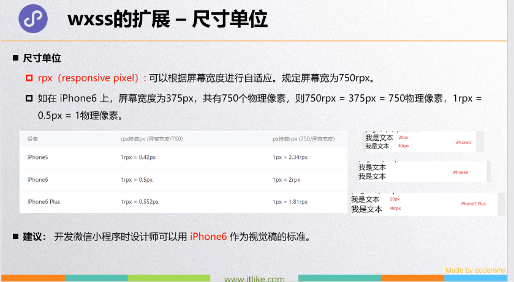

[TOC]

## 小程序简介

### 什么是小程序


### 小程序的发展


### 小程序的构架


### 小程序的双线程模式


### 界面渲染过程


### 小程序的启动流程


## 小程序的基本使用和组件

### 获取用户信息

1.js文件里的生明周期函数onshow调用==wx:getUserInfo(){success,error}==


2.wxml绑定点击事件==（open-type,bindgetuserinfo="函数名"）==

展示信息：==open-data标签 type属性==


### 获取全局数据


### 注册Page页面

常用的生命周期函数(==加载，显示，初次渲染完成==)

==onLoad --->onShow---> onReady==     onHide    onUnload 

wxml页面的自定义绑定事件：bindtap，delBtnClick，handelGetUserInfo

组件事件：onPullDownRefresh  onPageScroll   onResize  onShareAppMessage   onReachBottom


### text和button属性


### view属性


### image属性和选择图片


### 选择图片


### input组件


### scroll-view组件


### rpx




### 给wx：for起名字


## 用户授权登录


### 流程


```js
//用户登陆
function userLogin() {
  wx.checkSession({
    success: function () {
      //存在登陆态
    },
    fail: function () {
      //不存在登陆态
      onLogin()
    }
  })
}
 
function onLogin() {
  wx.login({
    success: function (res) {
      if (res.code) {
        //发起网络请求
        wx.request({
          url: 'Our Server ApiUrl',
          data: {
            code: res.code
          },
          success: function (res) {
            const self = this
            if (逻辑成功) {
              //获取到用户凭证 存儲 3rd_session 
              var json = JSON.parse(res.data.Data)
              wx.setStorage({
                key: "third_Session", 
                data: json.third_Session
              })
              getUserInfo()
            }
            else {
 
            }
          },
          fail: function (res) {
 
          }
        })
      }
    },
    fail: function (res) {
  
    }
  })
 
}
 
function getUserInfo() {
  wx.getUserInfo({
    success: function (res) {
      var userInfo = res.userInfo
      userInfoSetInSQL(userInfo)
    },
    fail: function () {
      userAccess()
    }
  })
}
 
function userInfoSetInSQL(userInfo) {
  wx.getStorage({
    key: 'third_Session',
    success: function (res) {
      wx.request({
        url: 'Our Server ApiUrl',
        data: {
          third_Session: res.data,
          nickName: userInfo.nickName,
          avatarUrl: userInfo.avatarUrl,
          gender: userInfo.gender,
          province: userInfo.province,
          city: userInfo.city,
          country: userInfo.country
        },
        success: function (res) {
          if (逻辑成功) {
            //SQL更新用户数据成功
          }
          else {
            //SQL更新用户数据失败
          }
        }
      })
    }
  })
}
```

