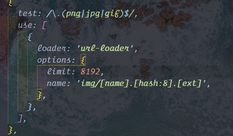
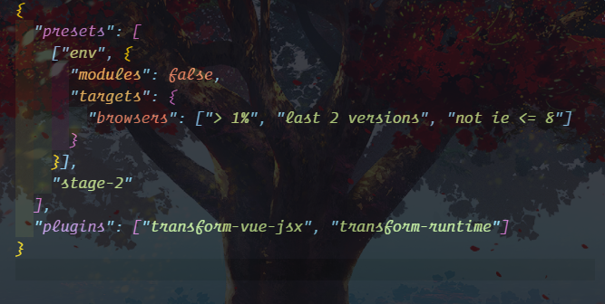

[TOC]

## grunt

### 前端集成解决方案

一套包含框架和工具，便于开发者快速构建美丽适用，稳健强壮的web应用程序的工作流。

### 安装和配置

配置：创建要管理的文件夹，根目录下创建package.json和Gruntfile.js文件

全局安装： npm install -g grunt-cli

开发环境安装：==npm install  --save-dev==

### Gruntfile.js配置

插件的安装（加载）和注册：grunt.loadNpmTasks('grunt-contrib-插件名');

 grunt.registerTask('default', ['uglify', 'watch', 'jshint', 'concat']);

插件的调用：==grunt 插件名 ==       ==执行任务是同步的（顺序有关）==

插件默认使用：==grunt==

```js
module.exports = function (grunt) {

  // 项目配置
  grunt.initConfig({
    //从package.json中读取配置
    pkg: grunt.file.readJSON('package.json'),
    //压缩任务
    uglify: {
      options: {
        banner: '/*! <%= pkg.name %> <%= grunt.template.today("yyyy-mm-dd") %> */\n'
      },
      build: {
        src: 'build/build.js',
        dest: 'build/build.min.js'
      }
    },
    //代码提示
    jshint: {
      files: ['src/TestGrunt.js'],
      reportOutput: ''
    },
    //文件监视
    watch: {
      files: ['src/<%= pkg.name %>.js'],
      tasks: ['jshint']
    },
    //文件合并
    concat: {
      options: {
        separator: ';'
      },
      dist: {
        src: 'src/js/*.js',
        dest: 'build/build.js'
      }
    }
  });

  // 加载插件。
  grunt.loadNpmTasks('grunt-contrib-uglify');
  grunt.loadNpmTasks('grunt-contrib-jshint');
  grunt.loadNpmTasks('grunt-contrib-watch');
  grunt.loadNpmTasks('grunt-contrib-concat');

  // 默认被执行的任务列表。
  grunt.registerTask('default', ['concat','uglify', 'watch', 'jshint']);

};
```


## gulp

### 特点：

gulp会有自己的内存空间，先从本地读取数据到gulp空间，完成一系列编译后在进行输出。==异步执行（return）。==

==为避免异步执行出现文件先后问题==(中间第二个参数)

```js
gulp.task('js',['less'],function(){
	return gulp.src()
        .pipe()
    	pipe(gulp.dest())
})
```


### 安装和配置

配置：创建要管理的文件夹，根目录下创建package.json和gulpfile.js文件

全局安装： npm install -g gulp

开发环境安装：==npm install  --save-dev==

### gulpfile.js配置

```js
var gulp = require('gulp');
var $=require('gulp-load-plugins')();//插件引入函数调用
//var concat = require("gulp-concat");
//var uglify = require("gulp-uglify");
//var rename = require("gulp-rename");
var open=require('open');

gulp.task("js", function () {
  return gulp.src("src/js/*.js")//输入路径
    .pipe($.concat("build.js"))//合并js
    .pipe($.uglify())//压缩js
    .pipe($.rename("build.min.js"))//重命名
    .pipe(gulp.dest("dist/js/"))//输出路径
})

//注册默认任务
 gulp.task('default',['js']);

//打包插件
//gulp-load-plugins

```


## webpack

### 了解

模块打包器：（builder）万物皆模块，除了html。==入口（entry）,输出（output），loader，插件（plugins）==

文件类型为：==js和json格式。==

webpack **插件**是一个具有 [`apply`](https://developer.mozilla.org/en-US/docs/Web/JavaScript/Reference/Global_Objects/Function/apply) 属性的 JavaScript 对象。`apply` 属性会被 webpack compiler 调用，并且 compiler 对象可在**整个**编译生命周期访问。


### loader、plugin 的区别

1.  loader 用于加载某些资源文件，只专注于转化文件（transform）这一个领域。
2.  它直接作用于 webpack，扩展了它的功能。基于事件机制工作，会监听webpack打包过程中的某些节点，执行广泛的任务。

    1 .**文档定义loader为在模块加载时的预处理文件，故loader运行在打包文件之前。**
     2 . **plugins的定义为处理loader无法处理的事物，例如loader只能在打包之前运行，但是plugins在整个编译周期都起作用。**


### 安装和打包

```js
 npm install webpack -g         
 npm install webpack-cli -g
//webpack -version 查看版本

//创建项目目录

//初始化项目
npm init //生成package.json文件

//安装依赖包,生成module
 npm i  webpack -D  
 npm i webpack-cli -D

//新建源码目录src src目录里面建一个index.js的文件

//打包  命令webpack
webpack --mode=development
webpack --mode=production
```

### 配置路径,名字属性

publicPath："dist/"

name:'img/[name].[hash:8].[ext]'




## babel

简介：语法编译器，可以将ES6代码转为ES5代码，从而在现有环境执行。


### 配置文件.babelrc

```js
{
  "presets": [],
  "plugins": []
}
```

### presets设置

```js
# ES2015转码规则
$ npm install --save-dev babel-preset-es2015

# react转码规则
$ npm install --save-dev babel-preset-react

# ES7不同阶段语法提案的转码规则（共有4个阶段），选装一个
$ npm install --save-dev babel-preset-stage-0
$ npm install --save-dev babel-preset-stage-1
$ npm install --save-dev babel-preset-stage-2
$ npm install --save-dev babel-preset-stage-3

  {
    "presets": [
      "es2015",
      "react",
      "stage-2"
    ],
    "plugins": []
  }
```

### 命令行转码babel-cli

```js
$ npm install --global babel-cli


//使用
# 转码结果输出到标准输出
$ babel example.js

# 转码结果写入一个文件
# --out-file 或 -o 参数指定输出文件
$ babel example.js --out-file compiled.js
# 或者
$ babel example.js -o compiled.js

# 整个目录转码
# --out-dir 或 -d 参数指定输出目录
$ babel src --out-dir lib
# 或者
$ babel src -d lib

# -s 参数生成source map文件
$ babel src -d lib -s
```

### babel-core

```js
$ npm install babel-core --save

//使用
var babel = require('babel-core');

// 字符串转码
babel.transform('code();', options);
// => { code, map, ast }

// 文件转码（异步）
babel.transformFile('filename.js', options, function(err, result) {
  result; // => { code, map, ast }
});

// 文件转码（同步）
babel.transformFileSync('filename.js', options);
// => { code, map, ast }

// Babel AST转码
babel.transformFromAst(ast, code, options);
// => { code, map, ast }
```


### babel-polyfill

polyfill是一个针对ES2015+环境的shim，实现上来说babel-polyfill包只是简单的把core-js和regenerator runtime包装了下，这两个包才是真正的实现代码所在。


### Babel的包构成

#### 核心包

*   ==babel-core==：babel转译器本身，提供了babel的转译API，如babel.transform等，用于对代码进行转译。像webpack的babel-loader就是调用这些API来完成转译过程的。
*   ==babylon==：js的词法解析器
*   ==babel-traverse==：用于对AST（抽象语法树，想了解的请自行查询编译原理）的遍历，主要给plugin用
*   ==babel-generator==：根据AST生成代码


#### 功能包

*   babel-types：用于检验、构建和改变AST树的节点

*   babel-template：辅助函数，用于从字符串形式的代码来构建AST树节点

*   babel-helpers：一系列预制的babel-template函数，用于提供给一些plugins使用

*   babel-code-frames：用于生成错误信息，打印出错误点源代码帧以及指出出错位置

*   **babel-plugin-xxx：babel转译过程中使用到的插件，其中babel-plugin-transform-xxx是transform步骤使用的**

*   **babel-preset-xxx：transform阶段使用到的一系列的plugin**

*   ==**babel-polyfill==：JS标准新增的原生对象和API的shim，实现上仅仅是core-js和regenerator-runtime两个包的封装**

*   **babel-runtime：功能类似babel-polyfill，一般用于library或plugin中，因为它不会污染全局作用域**

    

#### 工具包

babel-cli：babel的命令行工具，通过命令行对js代码进行转译
==babel-register==：通过绑定node.js的require来自动转译require引用的js代码文件


### babel的工作原理

只是把同种语言的高版本规则翻译成低版本规则。

babel只是转译新标准引入的语法，比如ES6的箭头函数转译成ES5的函数；而**新标准引入的新的原生对象，部分原生对象新增的原型方法，新增的API等（如Proxy、Set等），这些babel是不会转译的。需要用户自行引入polyfill来解决**

==babel的转译过程也分为三个阶段：**parsing、transforming、generating**==

```js
ES6代码输入 ==》 babylon进行解析 ==》 得到AST
==》 plugin用babel-traverse对AST树进行遍历转译 ==》 得到新的AST树
==》 用babel-generator通过AST树生成ES5代码
```


### @babel/preset-env

**preset-env**是一个**智能**预设，配置了它就可以让你用es6+去书写你的代码，而且他会按需去加载所需要的插件。


### Browserslist集成

关于**preset-env**，我们还可以提供一个`targets`配置项指定运行环境，就是我们可以配置对应目标浏览器环境，那么**babel**就会编译出对应目标浏览器环境可以运行的代码。

```js
/* babel.config.js */

module.exports = {
  presets: [
    [
      "@babel/preset-env", {
        'targets': {
          'browsers': ['ie >= 8', 'iOS 7'] // 支持ie8，直接使用iOS浏览器版本7
        }
      }
    ]
  ],
  plugins: [
  ]
}
```




### useBuiltIns

按需引入polyfill，选项：=="usage"| "entry"| false==，默认为false。

`entry`我们已经用过了，意义就是在入口处将根据我们配置的浏览器兼容，将目标浏览器环境所有不支持的API都引入。

`usage`就很nb了，当配置成usage的时候，babel会扫描你的每个文件，然后检查你都用到了哪些新的API，跟进我们配置的浏览器兼容，只引入相应API的polyfill。

```js
/* babel.config.js */

module.exports = {
  presets: [
    [
      "@babel/preset-env", {
        "modules": false,
        "useBuiltIns": "entry",
        "corejs": "3",
        'targets': {
          'browsers': ['not ie >= 8', 'iOS 7'] // 支持ie8，直接使用iOS浏览器版本7
        }
      }
    ]
  ],
  plugins: [
  ]
}
```

