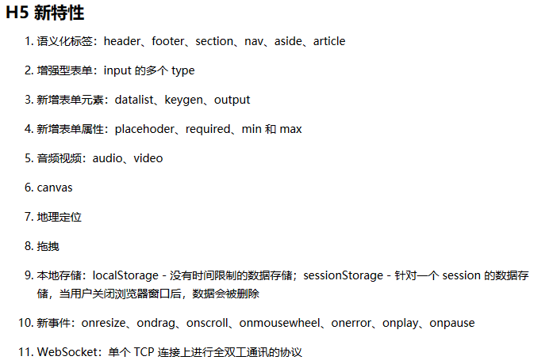
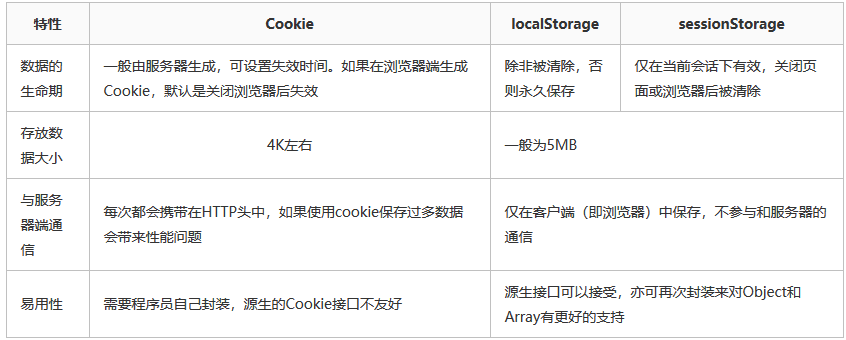
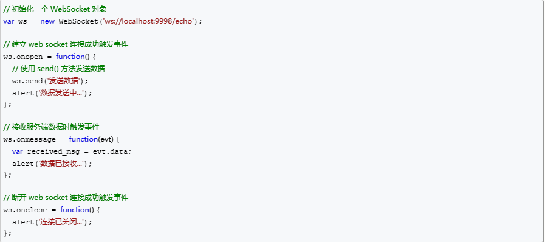
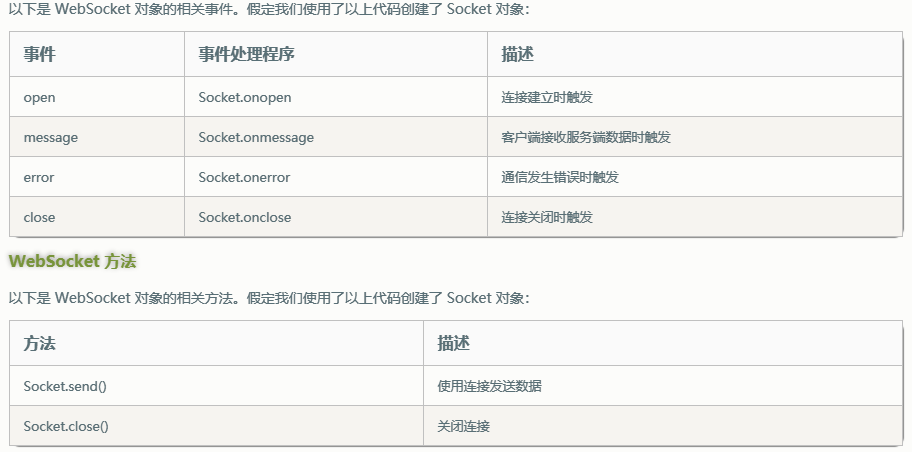

[TOC]

### （3）语义化

让标签有自己的含义，增加代码的可读性和维护性，SEO优化。

### （2）DOCTYPE 有什么作用？怎么写？

它是一种标记语言的文档类型声明，即告诉浏览器当前 HTML 以何种规则来解析文档。必须在文档的第一行。

### （7）h5新特性

标签语义化，表单控件和属性，canvas画布和svg绘图，定位（geoloction），音频和视频，拖拽，web/worker/storage/socket。

### （7）POST 和 GET 方式提交数据有什么区别？（后退，书签，缓存，历史，安全性，可见性，数据长度和类型的限制）

### （5）Web 标准以及 W3C 标准是什么？

标签闭合，小写，嵌套正确，外部链接css和js，提倡结构，表现，行为分离。

### （8）列出常见的标签，并简单介绍这些标签用在什么场景？

*   如果是标题，就用 `<h1>` ~ `<h6>`；
*   如果是一段话，就用 `
`；
*   如果不知道他是什么，如果这个东西能占一行，就用`
`；
*   如果没有一行，就一个小小的位置，就用``；
*   如果是可点击的就用一个`<a>`链接；
*   如果像那种并列一排排的，甚至还有一点一点，就用“列表”；
*   如果看到一个表格，就用`<table>`；
*   如果看到了一个输入框，就用`<input>`。

### （7）HTML 全局属性（global attribute）有哪些？

*   class：为元素设置类标识；
*   data-*：为元素增加自定义属性；
*   draggable：设置元素是否可拖拽；
*   id：元素 id，文档内唯一；
*   lang：元素内容的的语言；
*   style：行内 css 样式；
*   title：元素相关的建议信息。

### （10）从 URL 输入到页面展现背后发生了什么事？

键盘或触屏输入URL并回车确认

URL解析/DNS解析查找域名IP地址

网络连接发起HTTP请求

HTTP报文传输过程

服务器接收数据

服务器响应请求/MVC

服务器返回数据

客户端接收数据

浏览器加载/渲染页面

打印绘制输出

### （6）一次完整的 HTTP 事务是怎么一个过程？

a. 域名解析

b. 发起TCP的3次握手

c. 建立TCP连接后发起http请求

d. 服务器端响应http请求，浏览器得到html代码

e. 浏览器解析html代码，并请求html代码中的资源

f. 浏览器对页面进行渲染呈现给用户

### （5）浏览器是如何渲染页面的？

1.  处理HTML标记并构建DOM树
2.  处理CSS标记并构建CSSOM树
3.  将DOM与CSSOM合并成一个渲染树
4.  根据渲染树来布局，计算每个节点的布局信息
5.  将各个节点绘制到屏幕上

### （4）刷新页面,JS 请求一般会有哪些地方有缓存处理?

DNS缓存：短时间内多次访问某个网站，在限定时间内，不用多次访问DNS服务器。

CDN缓存：内容分发网络（人们可以在就近的代售点取火车票了，不用非得到火车站去排队）

浏览器缓存：浏览器在用户磁盘上，对最新请求过的文档进行了存储。

服务器缓存：将需要频繁访问的Web页面和对象保存在离用户更近的系统中，当再次访问这些对象的时候加快了速度。

### （2）meta viewport 是做什么用的,怎么写?meta标签是什么？

meta viewport是专门为移动设备下的显示所设计的，name，content，width，user-scalable，initial-scale，maximum，minimum

META标签用来描述一个HTML网页文档的属性，元数据，机器可读，例如作者、日期和时间、网页描述、关键词、页面刷新等。

### （4）input中，name有什么用？

1.作为一个标识，通过name获取元素内的值
2.在radio，单选框中，通过设置相同的name来规定只能选择一个
3.给页面加一个锚点

4.作为服务器端的标示，我们可以在服务器端根据其name取得元素提交的值

### （3）常见 Web 安全及防护原理?

sql注入原理   xss(跨站脚本攻击)，csrf（盗用用户身份）

### （4）http和https？

1、https协议需要到CA  （Certificate Authority，证书颁发机构）申请证书，一般免费证书较少，因而需要一定费用。(原来网易官网是http，而网易邮箱是https。)

2、http是超文本传输协议，信息是明文传输，https则是具有安全性的ssl加密传输协议。

3、http和https使用的是完全不同的连接方式，用的端口也不一样，前者是80，后者是443。

4、http的连接很简单，是无状态的。Https协议是由SSL+Http协议构建的可进行加密传输、身份认证的网络协议，比http协议安全。(无状态的意思是其数据包的发送、传输和接收都是相互独立的。无连接的意思是指通信双方都不长久的维持对方的任何信息。)

### （1，5）ifame?

包含另一个文档的内联框架；阻塞onload事件，SEO，和主页面共享连接池，影响页面加载，产生很多页面，会增加服务器的http请求。

### （3）cookie，localStorage和sessionStorage？

### （2）webscoket？

WebSocket 是 HTML5 开始提供的一种在单个 TCP 连接上进行全双工通讯的协议。Websocket是一个**持久化**的协议，相对于HTTP这种**非持久**的协议。

